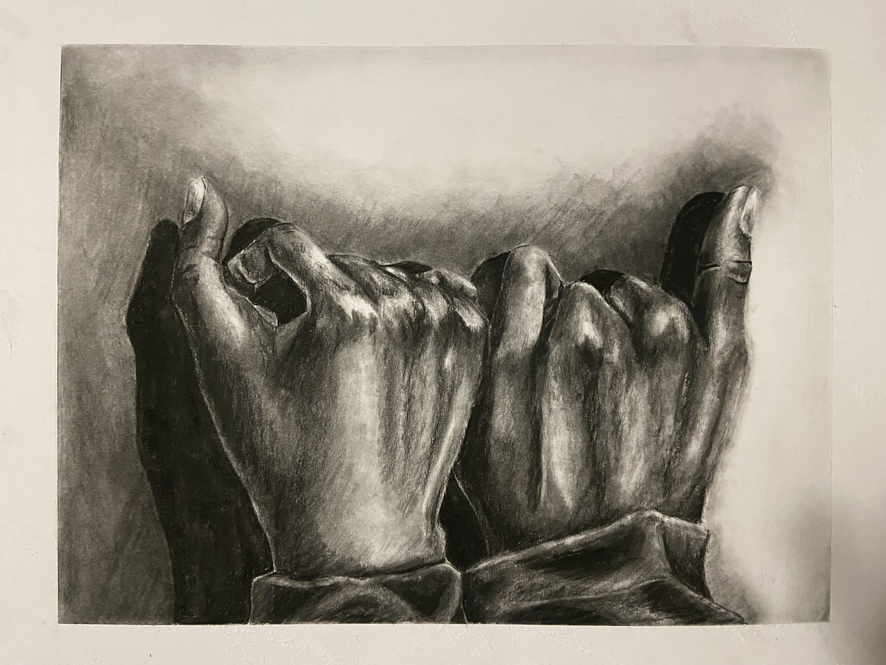
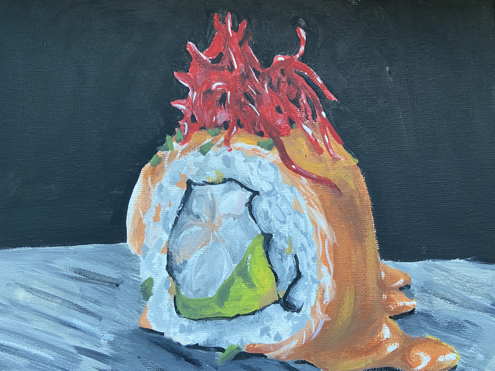

# jinty

This website is to display some of my proud art works 😸

Follow my [Instagram](https://instagram.com/shiroiih?igshid=MzRIODBiNWFIZA==).

## Himeji Castle Architecture

**Medium**: Pen

### This piece required the use of a grid, transferring the image of the Castle onto paper.
Image [here](https://www.japan-guide.com/g21/3501_11.jpg)

## Hands

**Medium**: Charcoal

### This piece is me and my brother's hand linked together. 

## Sushi

**Medium**: Acrylic Paint
### This is a painting made for my dad he is a sushi chef. 

## Northern Lights

**Medium**: Acrylics
### This painting contains the popular Northern Lights.

## Bird of Paridise

**Medium**: Water Color & Colored Pencils

### This piece replicate the flower Bird of Paridise along with little water droplets.

